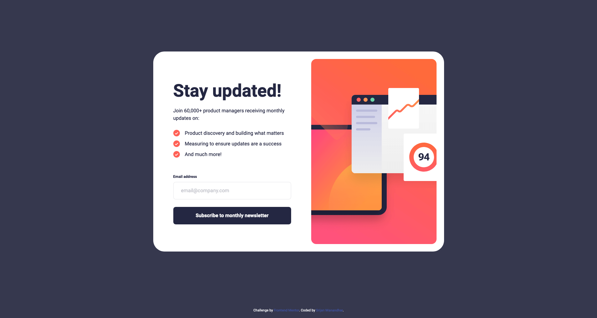
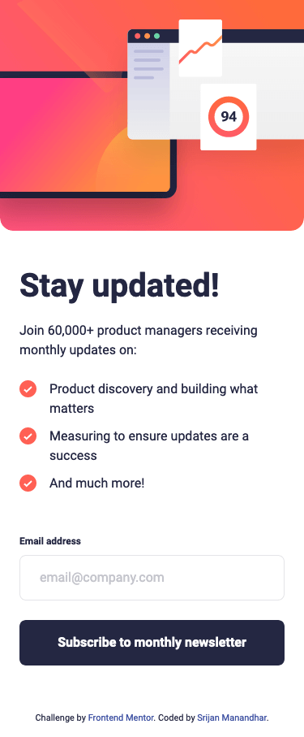

# Frontend Mentor - Newsletter sign-up form with success message solution

This is a solution to the [Newsletter sign-up form with success message challenge on Frontend Mentor](https://www.frontendmentor.io/challenges/newsletter-signup-form-with-success-message-3FC1AZbNrv). Frontend Mentor challenges help you improve your coding skills by building realistic projects.

## Table of contents

- [Overview](#overview)
  - [The challenge](#the-challenge)
  - [Screenshot](#screenshot)
  - [Links](#links)
- [My process](#my-process)
  - [Built with](#built-with)
  - [What I learned](#what-i-learned)
  - [Useful resources](#useful-resources)
- [Author](#author)

## Overview

### The challenge

Users should be able to:

- Add their email and submit the form
- See a success message with their email after successfully submitting the form
- See form validation messages if:
  - The field is left empty
  - The email address is not formatted correctly
- View the optimal layout for the interface depending on their device's screen size
- See hover and focus states for all interactive elements on the page

### Screenshot




### Links

- Solution URL: [https://github.com/srijanss/newsletter-sign-up-form](https://github.com/srijanss/newsletter-sign-up-form)
- Live Site URL: [https://srijanss.github.io/newsletter-sign-up-form/](https://srijanss.github.io/newsletter-sign-up-form/)

## My process

### Built with

- Semantic HTML5 markup
- CSS custom properties
- Flexbox
- CSS Grid
- Mobile-first workflow
- [Vite](https://vitejs.dev/) - Lightweight frontend tooling
- [PostCSS](https://postcss.org/) - Tool to transform CSS using plugins

### What I learned

Use this section to recap over some of your major learnings while working through this project. Writing these out and providing code samples of areas you want to highlight is a great way to reinforce your own knowledge.

To see how you can add code snippets, see below:

```html
<div class="card__form__group card__form__group--email">
  <label for="email">
    <span class="label-text">Email address</span>
    <span class="error" aria-live="polite"></span>
  </label>
  <input
    type="email"
    class="card__form__input"
    id="email"
    name="email"
    placeholder="email@company.com"
    required
  />
</div>
```

I got to learn about the aria-live attribute to make my form more accessible. This is announce the error messages who is using assistive technologies.

```css
button {
  width: 100%;
  height: 56px;
  border-radius: 8px;
  border: none;
  background-color: var(--dark-slate-grey);
  font-family: var(--font-family-bold);
  font-size: 16px;
  line-height: 1.5;
  color: var(--white);
  &:focus,
  &:hover {
    background: linear-gradient(
      to left bottom,
      var(--color-primary),
      var(--color-primary-dark)
    );
    box-shadow: 0 16px 32px 0 var(--color-primary-shadow);
  }
}
```

I got to learn about creating gradients and different configurations related to it.

```js
signUpForm.addEventListener("submit", (e) => {
  e.preventDefault();
  if (!emailInput.validity.valid) {
    toggleErrorMessage(emailInput, emailInputErrorEl, "Valid email required");
  } else {
    const formData = new FormData(e.target);
    const data = Object.fromEntries(formData);
    toggleErrorMessage(emailInput, emailInputErrorEl, "");
    toggleFormAndSuccessMessageVisibility(data.email);
  }
});
```

I got to learn about how FormData can be used to get user input from the form. It's really neat and handy feature.

### Useful resources

- [Linear Gradietn](https://developer.mozilla.org/en-US/docs/Web/CSS/gradient/linear-gradient) - This helped me for creating linear-gradient for button :focus and :hover states.

## Author

- Website - [Srijan Manandhar](https://github.com/srijanss)
- Frontend Mentor - [@srijanss](https://www.frontendmentor.io/profile/srijanss)
